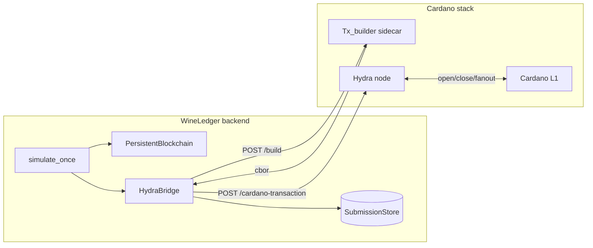

# Cardano + Hydra integration

This document is the developer-facing companion to the operations
[runbook](../ops/cardano/runbook.md) and the
"Cardano platform alignment" section of [`README.md`](../README.md). It
covers what the integration is, the seams in the codebase, and how to
go from `disabled` (default) to `dryrun` to `live`.

## What the integration does (and does not)

The bridge in [`app/cardano/`](../app/cardano) projects each WineLedger
[`Block`](../app/models.py) into a CIP-68-shaped event datum and offers
to submit a Cardano transaction representing that state transition to a
Hydra head. It deliberately does not:

- Build raw Cardano transactions in Python — the
  [`TxBuilder`](../app/cardano/tx_builder.py) Protocol delegates that to
  a sidecar (Lucid, Mesh, or a `cardano-cli` wrapper).
- Hold signing keys — those live with the sidecar.
- Replace the local SHA-256 chain — the chain stays the source of truth
  and the Cardano write path is best-effort dual-write.

> **Naming reminder.** This repository's canvas is **Hydra Synth**
> (`hydra-synth`), used in [`frontend/src/renderer.js`](../frontend/src/renderer.js).
> **Cardano Hydra** is a different project — a Layer-2 state-channel
> framework. Both names appear here on purpose; do not confuse them in
> grant copy or UI strings.

## Architecture



The bridge is the only code that needs to change when the underlying
sidecar or Hydra version changes; everything upstream of it
(`simulate_once`, the WebSocket payload, the React/Vite frontend) keeps
working unmodified.

## Code map

| File | Responsibility |
|------|----------------|
| [`config.py`](../app/cardano/config.py) | Resolve env vars into a frozen `CardanoSettings`. |
| [`datum.py`](../app/cardano/datum.py) | `EventDatum`, deterministic content hash, transition validator. |
| [`submissions.py`](../app/cardano/submissions.py) | JSON-backed `SubmissionStore` keyed by `event_id`. |
| [`tx_builder.py`](../app/cardano/tx_builder.py) | `TxBuilder` Protocol + `DryRunTxBuilder` and `SidecarTxBuilder`. |
| [`hydra_client.py`](../app/cardano/hydra_client.py) | `HydraClient` Protocol + `HttpHydraClient` and `MockHydraClient`. |
| [`bridge.py`](../app/cardano/bridge.py) | `HydraBridge` — orchestrates everything, handles failure. |

The FastAPI app wires the bridge in [`app/main.py`](../app/main.py) and
exposes `/cardano/status`, `/cardano/dryrun`,
`/cardano/submissions`, and `/cardano/submissions/{event_id}`.

## Phase 0 — Stack decisions captured in code

| Choice | Decision | Where it lives |
|--------|----------|----------------|
| Network | `preview` (default) — change with `WINELEDGER_CARDANO_NETWORK`. | [`config.py`](../app/cardano/config.py) |
| Contract language | Aiken (preferred) — Plutus validators live outside this repo. | Documented here; not yet shipped. |
| Off-chain tx assembly | HTTP sidecar consumed by `SidecarTxBuilder`. | [`tx_builder.py`](../app/cardano/tx_builder.py) |
| State model | CIP-68 reference + standard token; per-event datum updates. | [`datum.py`](../app/cardano/datum.py) |

Pick a sidecar implementation that matches your team:

- **Lucid (TypeScript)** — fastest path; integrates well with Blockfrost.
- **Mesh** — TypeScript, friendlier wallet integration, supports Aiken.
- **cardano-cli + custom wrapper** — closest to the metal; verbose.

The Python side does not care which one you pick: only the JSON
contract in `SidecarTxBuilder` matters.

## Phase 1 — L1 foundation

Before turning on the bridge in `live` mode, prove the L1 loop with a
script that uses the same sidecar endpoint your `live` deployment will
hit. Minimum acceptance test:

1. Sidecar mints a CIP-68 reference token on Preview testnet.
2. Sidecar updates the standard token's datum once.
3. The tx submission returns a tx id you can find on a Cardano explorer
   pointed at Preview.

Only then plug the same sidecar into `WINELEDGER_CARDANO_TX_BUILDER_URL`
and turn on `dryrun` first to confirm the request shape, then `live`.

## Phase 2 — Hydra runtime

The reference [`docker-compose.example.yml`](../ops/cardano/docker-compose.example.yml)
wires `cardano-node`, `hydra-node`, the tx-builder sidecar, and
WineLedger together. Steps the bridge does not automate (the Hydra
documentation is the authority):

1. Generate Hydra and Cardano signing keys for each party.
2. Fund each party on L1 (Preview faucet) so the head can be opened.
3. `Init` the head, wait for `HeadIsOpen`, then submit txs through the
   bridge.
4. `Close` and `Fanout` to settle when the demo is done.

The bridge confirms reachability via `GET /cardano/status`. If the
Hydra version exposes a different submission route, swap the client by
implementing the small `HydraClient` Protocol and injecting it via
`HydraBridge.from_settings(..., client=...)`.

## Phase 3 — Datum and validator rules

`EventDatum` carries:

- `ref_token` — the CIP-68 reference asset name (long-lived identity).
- `block_index`, `previous_hash`, `block_hash` — anchor every L2 update
  to the local chain so an auditor can correlate L1/L2/local state.
- `event` — the full supply-chain event, mirrored from
  [`SupplyChainEvent`](../app/models.py).
- `version` — schema version for safe migrations.

Stage transitions allowed:

```
GENESIS → HARVEST → FERMENTATION → BARREL_AGING → BOTTLING → TRANSPORT → RETAIL → HARVEST → ...
```

The same rules belong inside the eventual Aiken validator. The Python
check in `validate_transition` is a fast-fail mirror so bad inputs never
make it to the sidecar.

## Phase 4 — FastAPI bridge

Endpoints exposed:

| Method | Path | Purpose |
|--------|------|---------|
| `GET` | `/cardano/status` | Mode, network, head id, sidecar name, Hydra reachability. |
| `POST` | `/cardano/dryrun` | Build the CIP-68 datum for the latest block — no submission. |
| `GET` | `/cardano/submissions?limit=N` | List recent submissions (newest last). |
| `GET` | `/cardano/submissions/{event_id}` | Look up a single submission. |

The websocket and `/chain` payloads gain an optional `cardano` field on
each block. When the bridge is `disabled` (default) the field is `null`
and the existing UI ignores it.

## Phase 5 — Hardening checklist (before mainnet)

- [ ] Sidecar runs in its own network namespace; no public ingress.
- [ ] Hydra signing keys are stored in a secret manager, not on disk.
- [ ] `/simulate-once` is rate-limited or behind auth in production.
- [ ] Aiken validators are reviewed by an external party.
- [ ] `data/cardano_submissions.json` is mounted on durable storage and
      backed up alongside `data/chain.json`.
- [ ] Alerting on `status.hydra.reachable == false` and on a rising
      `failed` submission count.

## Environment variables

| Variable | Default | Purpose |
|----------|---------|---------|
| `WINELEDGER_HYDRA_MODE` | `disabled` | `disabled` / `dryrun` / `live`. |
| `WINELEDGER_HYDRA_URL` | _unset_ | Base URL of the Hydra node REST API. |
| `WINELEDGER_HYDRA_HEAD_ID` | _unset_ | Label stored on each submission for traceability. |
| `WINELEDGER_CARDANO_TX_BUILDER_URL` | _unset_ | Sidecar URL implementing `POST /build`. |
| `WINELEDGER_CARDANO_NETWORK` | `preview` | `preview` / `preprod` / `mainnet`. |
| `WINELEDGER_CARDANO_REF_TOKEN` | `WINELEDGER-BATCH` | CIP-68 reference asset name. |
| `WINELEDGER_CARDANO_SUBMISSIONS_PATH` | `data/cardano_submissions.json` | Dual-write store path. |
| `WINELEDGER_CARDANO_HTTP_TIMEOUT_S` | `5.0` | HTTP timeout for sidecar + Hydra calls. |
